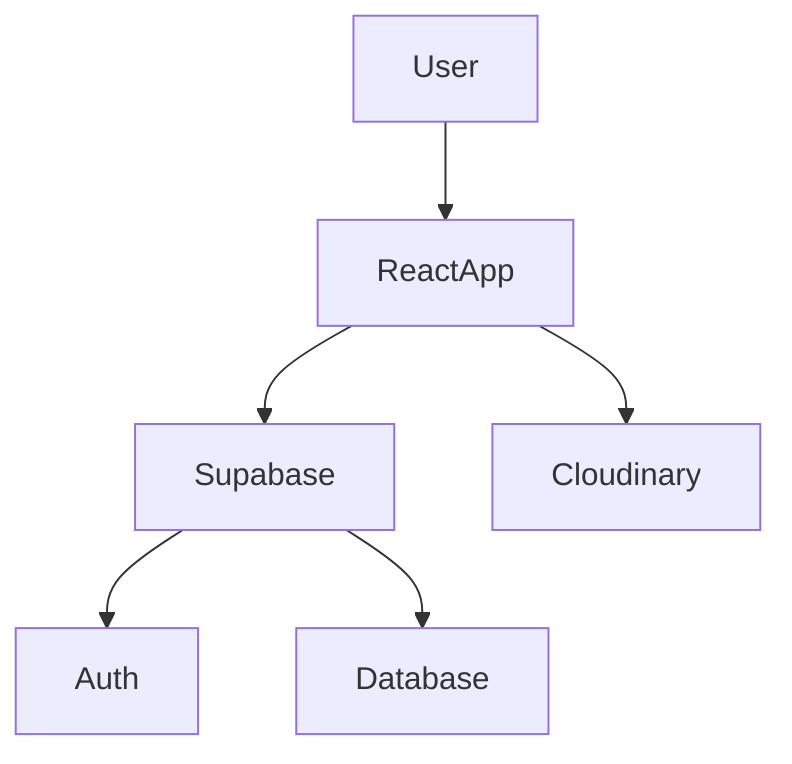
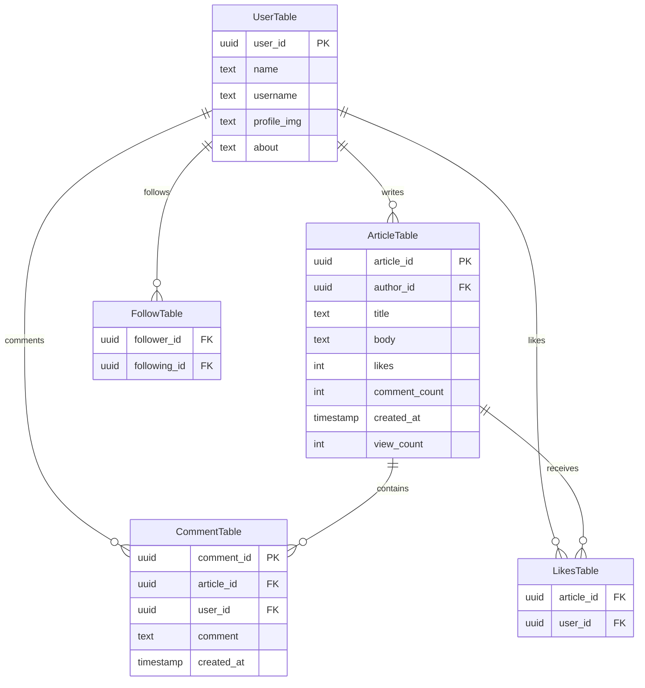

#  [Pennat](https://pennat.vercel.app/home) 

Welcome to **Pennat** — a modern blogging platform where writing feels fast, reading feels social, and the app can live on your home screen like a real installable product 📲✨

With Pennat you can:
- Write rich articles (Tiptap) 
- Discover posts via feeds + search 
- Like, comment, and follow authors
- Build your profile + vibe 
- Install as an app 
- Toggle light/dark themes

<b> 🌐 Live Demo : </b>

[Pennat Live](https://pennat.vercel.app/home)

---

## Features ✨

- Rich text article editor
- Authentication system
- Follow/unfollow users
- Article engagement system
- Dark/light theme
- PWA support
- Responsive UI


## Tech Stack 💻

- React 19 + React Router
- Vite  + Vite PWA
- Tailwind CSS v4
- Supabase
- Cloudinary
- Tiptap 


---


## Running Pennat Locally 🚀


Follow these steps to set up and run the project on your local machine.


### 📋 1. Prerequisites

Make sure the following are installed and configured before starting:

* Node.js and npm
* A Supabase project

  * Supabase Project URL
  * Supabase Anon/Public Key
* A Cloudinary account

  * Cloud Name
  * Upload Preset


### 📦 2. Install Dependencies
Install all required packages:

```bash
npm install
```


### 🔐 3. Configure Environment Variables
Create a `.env` file in the project root directory and add the following variables:

```env
VITE_SUPABASE_URL=your_supabase_url
VITE_SUPABASE_PUBLISHABLE_DEFAULT_KEY=your_supabase_anon_key

VITE_CLOUDINARY_CLOUD_NAME=your_cloudinary_cloud_name
VITE_CLOUDINARY_UPLOAD_PRESET=your_upload_preset
```

##### 🧠 Notes

* `VITE_SUPABASE_PUBLISHABLE_DEFAULT_KEY` refers to the **Supabase anon/public key** used on the client side.
* All environment variables must start with the `VITE_` prefix to be exposed by Vite.


 ### 🖼️  4. Cloudinary Setup 

Pennat uploads images to Cloudinary using:
- `VITE_CLOUDINARY_CLOUD_NAME`
- `VITE_CLOUDINARY_UPLOAD_PRESET`

Make sure your **upload preset** supports the upload mode you’re using (often unsigned) and the resource types you need ✅
 
 
  ###  📲 5. PWA (Progressive Web App)

Pennat is PWA-enabled via `vite-plugin-pwa` and configured with `autoUpdate`.

- Manifest settings live in `vite.config.js` 🧩
- For the most realistic PWA behavior locally, use:


Installability depends on browser rules (localhost is usually OK) 🌍


### ▶️ 6. Start the Development Server

Run the following command:

```bash
npm run dev
```

After the server starts, Vite will display a local development URL in the terminal.

Open that URL in your browser  to access the application.


---


## Usage 🧵


### If you’re here to read 📖
- Browse timelines + home feed 
- Search for articles 
- Like and comment 
- Follow people and keep up with them 

### If you’re here to write ✍️
- Publish with a rich-text editor 
- Add images 
- Track engagement


## Screenshots 📸 


#### Homepage 


#### Profile Page


#### Article Page


#### Comments 


----


## Project structure 📂


```
src/
  components/    UI + feature components
  context/       React contexts for user/data/theme
  config/        Supabase client
  utils/         Helpers
  assets/        Static assets
```

---


## Pennat Architecture 🗾

<br/>

---

## Supabase Database Schema 🗄️ 

Pennat uses Supabase for:

* 🔐 Authentication
* 💾 Database storage
* 👤 User management

The frontend expects the following tables and relationships to exist.

---

### 📋 Required Tables

#### 👤 `UserTable`

Stores user profile information.

| Column        | Description            |
| ------------- | ---------------------- |
| `user_id`     | Unique user identifier |
| `name`        | Display name           |
| `username`    | Public username        |
| `profile_img` | Profile image URL      |
| `about`       | User bio/about section |

---

#### 📝 `ArticleTable`

Stores articles/posts created by users.

| Column          | Description               |
| --------------- | ------------------------- |
| `article_id`    | Unique article identifier |
| `author_id`     | Reference to the author   |
| `title`         | Article title             |
| `body`          | Article content           |
| `likes`         | Total likes count         |
| `comment_count` | Total comments count      |
| `created_at`    | Creation timestamp        |
| `view_count`    | Number of views           |
| `images`        | Attached image URLs       |

---

#### 💬 `CommentTable`

Stores comments on articles.

| Column       | Description               |
| ------------ | ------------------------- |
| `comment_id` | Unique comment identifier |
| `article_id` | Related article           |
| `user_id`    | Comment author            |
| `comment`    | Comment text              |
| `created_at` | Creation timestamp        |

---

#### ❤️ `LikesTable`

Tracks which users liked which articles.

| Column       | Description                |
| ------------ | -------------------------- |
| `article_id` | Liked article              |
| `user_id`    | User who liked the article |

---

#### 👥 `FollowTable`

Stores user follow relationships.

| Column         | Description         |
| -------------- | ------------------- |
| `follower_id`  | User who follows    |
| `following_id` | User being followed |

---

### 🔗 Database Relationships



---

### 🧱 Recommended Constraints

For a reliable and scalable setup, configure the following database constraints.

#### 🔑 Primary Keys

Add primary keys to all identifier columns:

* `UserTable.user_id`
* `ArticleTable.article_id`
* `CommentTable.comment_id`

---

#### 🔗 Foreign Keys

Configure relationships between tables:

* `ArticleTable.author_id → UserTable.user_id`
* `CommentTable.article_id → ArticleTable.article_id`
* `CommentTable.user_id → UserTable.user_id`
* `LikesTable.article_id → ArticleTable.article_id`
* `LikesTable.user_id → UserTable.user_id`
* `FollowTable.follower_id → UserTable.user_id`
* `FollowTable.following_id → UserTable.user_id`

---

#### 🧷 Unique Constraints

Prevent duplicate relationships:

| Table         | Constraint                                   |
| ------------- | -------------------------------------------- |
| `LikesTable`  | `(article_id, user_id)` must be unique       |
| `FollowTable` | `(follower_id, following_id)` must be unique |
| `UserTable`   | `username` should be unique                  |


---


#### ✅ Recommended Extras

Optional but highly recommended:

* Add indexes on frequently queried columns
* Enable Row Level Security (RLS)
* Add `updated_at` timestamps
* Use UUIDs for all IDs
* Store image URLs instead of raw files
  
 

---


## Future Improvements 🏗️


- Direct messaging system
- Personalized recommendation feed
- Real-time notifications
- User moderation tools
- Saved/bookmarked articles


---


## Contributing 🤝

Want to help?
- Run `npm run lint` before opening a PR ✅
- Keep PRs small and focused (one feature/fix per PR) 🎯


